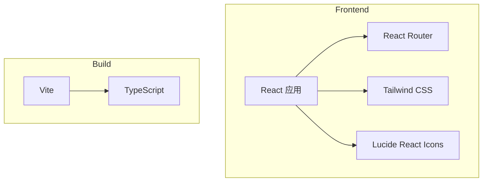

## 1. 架构设计

## 2. 技术描述
- **前端**：React@18 + TypeScript + Tailwind CSS + Vite
- **初始化工具**：vite-init
- **后端**：无（纯前端项目）
- **数据库**：无（静态内容）

## 3. 路由定义
| 路由 | 用途 |
|-------|---------|
| / | 首页 |
| /products | 产品页 |
| /download | 下载页 |

## 4. API 定义（如后端存在）
不适用

## 5. 服务器架构图（如后端存在）
不适用

## 6. 数据模型（如适用）
不适用
