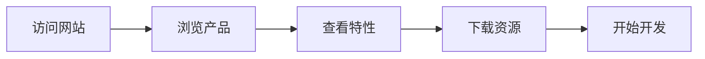

## 1. 产品概述

OpenRobotVision 是一个专注于机器人视觉与自动化外设控制的开源平台，提供完整的硬件模块、软件工具和仿真环境。

- 主要目的：为机器人开发者和研究者提供一站式的视觉感知与外设控制解决方案
- 目标用户：机器人工程师、AI 研究者、创客、教育工作者
- 市场价值：填补低成本、高性能机器人视觉开发平台的市场空白

## 2. 核心功能

### 2.1 用户角色（如适用）
无需用户角色区分，所有访客均可浏览和下载资源。

### 2.2 功能模块
1. **首页**：英雄区、导航、产品展示、特性介绍
2. **下载页**：软件下载、硬件规格、文档资源
3. **产品页**：视觉模块、外设控制器、配件展示

### 2.3 页面详情
| 页面名称 | 模块名称 | 功能描述 |
|-----------|-------------|---------------------|
| 首页 | Hero 区域 | 展示品牌标语、主要产品、CTA 按钮 |
| 首页 | 特性展示 | 自动化外设控制、视觉模块、仿真调试 |
| 首页 | 产品卡片 | 核心硬件产品展示 |
| 下载页 | 下载区域 | IDE、固件、驱动程序下载 |
| 下载页 | 文档区域 | 快速入门、API 文档、教程 |
| 产品页 | 产品列表 | 详细规格参数、价格信息 |

## 3. 核心流程
用户访问网站 → 浏览产品和特性 → 下载软件和文档 → 开始开发。

## 4. 用户界面设计

### 4.1 设计风格
- **主色调**：深蓝色 (#0f172a)、科技蓝 (#3b82f6)、亮青色 (#06b6d4)
- **按钮风格**：圆角矩形，带有悬停阴影和过渡动画
- **字体**：Poppins 用于标题，Inter 用于正文
- **布局风格**：卡片式布局，顶部导航栏
- **图标风格**：线性图标，来自 Lucide React

### 4.2 页面设计概述
| 页面名称 | 模块名称 | UI 元素 |
|-----------|-------------|-------------|
| 首页 | Hero 区域 | 深色背景、渐变文字、动画效果、CTA 按钮 |
| 首页 | 特性展示 | 三列网格、图标卡片、悬停动画 |
| 首页 | 产品卡片 | 产品图片、名称、简短描述 |
| 下载页 | 下载区域 | 下载按钮、版本信息、系统要求 |
| 下载页 | 文档区域 | 卡片网格、文档图标、链接 |

### 4.3 响应式设计
- Desktop-first 设计，适配移动设备
- 使用 Tailwind 响应式断点
- 触摸优化的交互元素

### 4.4 3D 场景指导（如适用）
不适用
